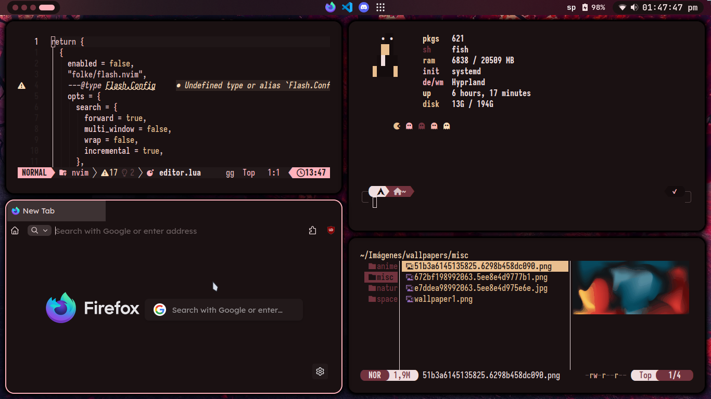

  

## Description

This repository contains my modifications to the dynamic dotfiles from [linkfrg/dotfiles](https://github.com/linkfrg/dotfiles), which use [Ignis](https://github.com/linkfrg/ignis) to generate color palettes based on the wallpaper. Here, I share my additions and adjustments as an extension of the original project.

## Modifications

- Support for programs without file inclusion in their configuration.
- Support for the `foot` terminal.
- Support for Firefox through [Cascade](https://github.com/cascadefox/cascade) (modified).
- Support for Neovim using [Catppuccin](https://github.com/catppuccin/nvim).
- Support for dual monitors in the status bar.
- Custom adjustments in Hyprland configuration.

## Requirements

- The same as [linkfrg/dotfiles](https://github.com/linkfrg/dotfiles) (Ignis, Python, etc.).
- [Foot](https://codeberg.org/dnkl/foot) (optional, for terminal support).
- [LazyVim](https://www.lazyvim.org/) and the [Catppuccin](https://github.com/catppuccin/nvim) plugin (for Neovim).
- Firefox with support for `userChrome.css` and `userContent.css`.
- [Hyprland](https://hyprland.org/) as a window manager.

## Installation

1. Follow the installation instructions from the original repository: [linkfrg/dotfiles](https://github.com/linkfrg/dotfiles).
2. Clone this repository and replace the files.
