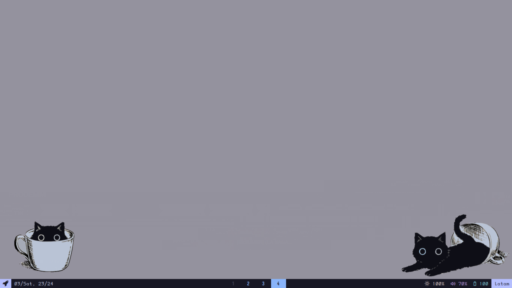
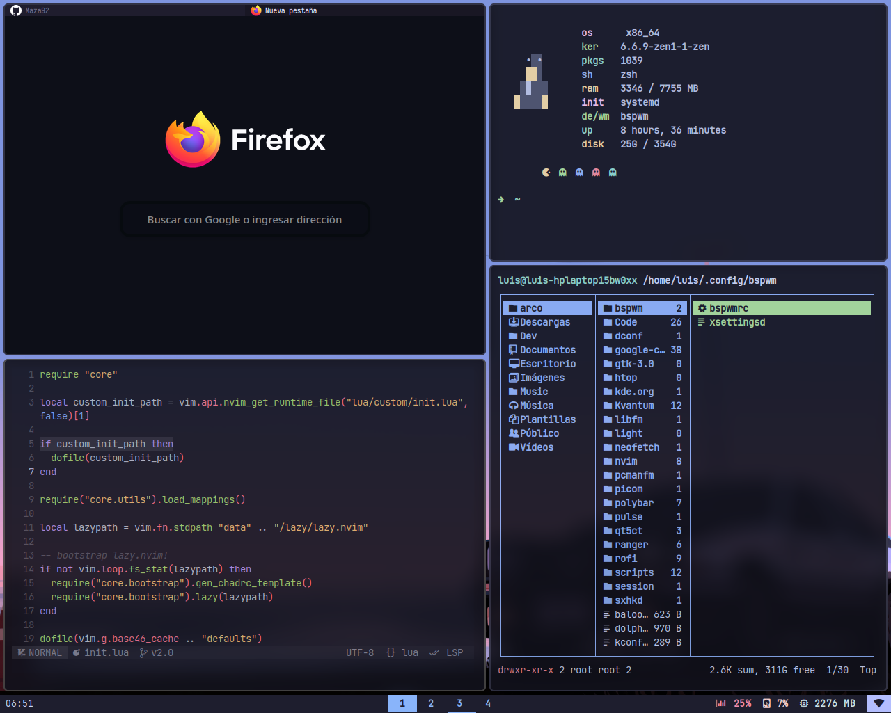

  
  
  

## INFORMATION
- **OS:** [Arch Linux](https://archlinux.org)
- **WM:** [bspwm](https://github.com/baskerville/bspwm)
- **Terminal:** [St](https://git.suckless.org/st/)
- **Shell:** [zsh](https://www.zsh.org/)
- **Compositor:** [picom](https://github.com/yshui/picom)
- **Launcher:** [rofi](https://github.com/davatorium/rofi)

## CREDITS

These dotfiles are a collection of settings that I have modified and adapted for my personal use.

- The configuration files and scripts of rofi are based on those of [adi1090x](https://github.com/adi1090x/rofi)
- The build of st that I use is based on [Siduck's](https://github.com/siduck/st)
